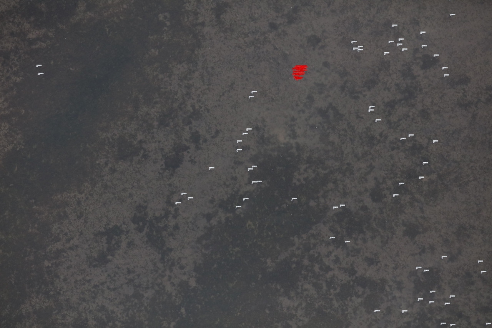
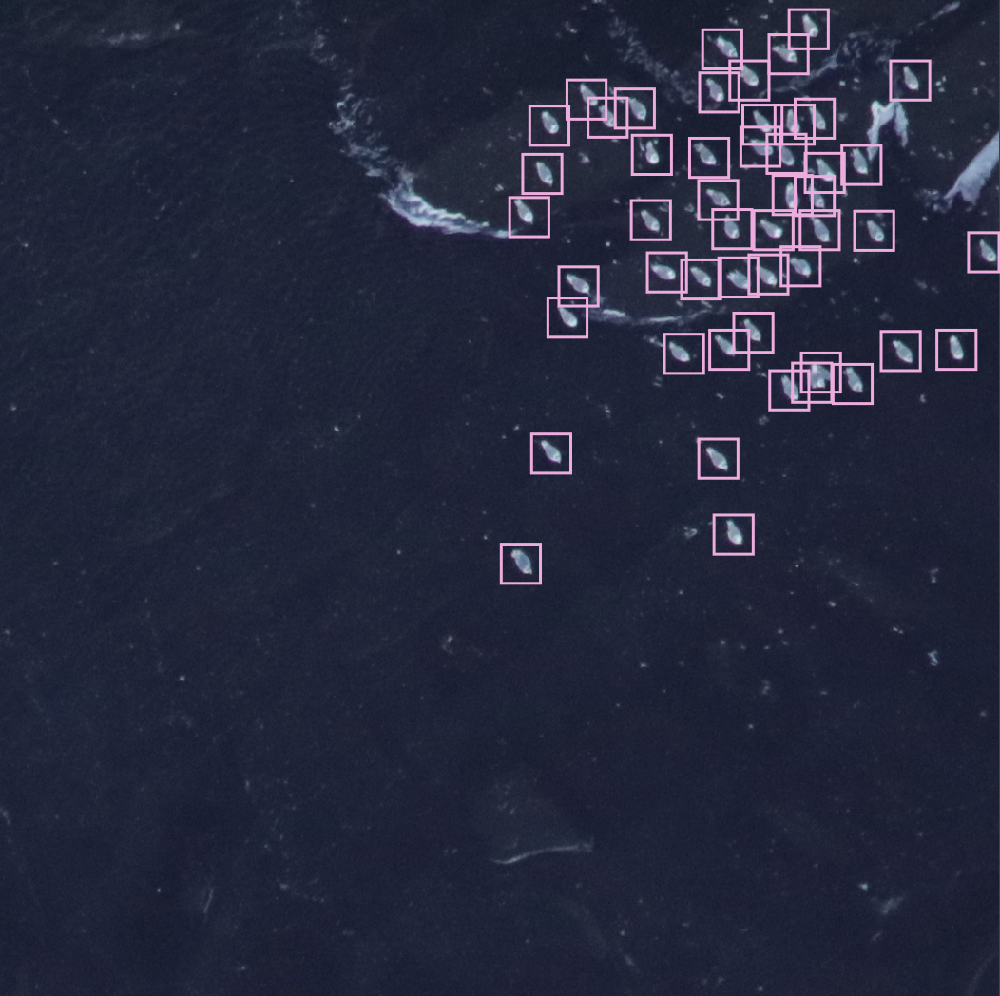
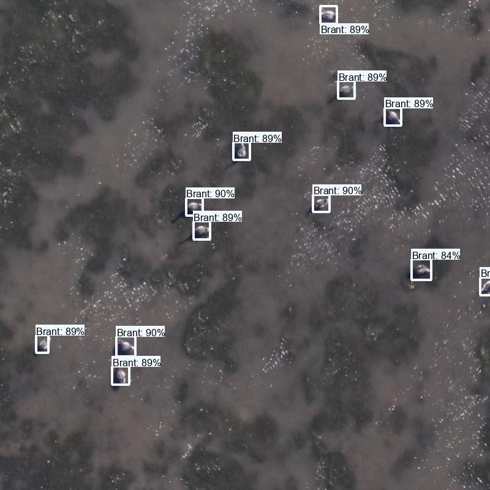

## USGS goose detector training

### Overview

The code in this repo trains and evaluates models to detect geese in aerial images, based on the <a href="https://www.usgs.gov/data/aerial-photo-imagery-fall-waterfowl-surveys-izembek-lagoon-alaska-2017-2019">Izembek Lagoon dataset</a> (complete citation [below](#data-source)).  Images are annotated with points, labeled as brant, Canada, gull, emperor, and other.  The goal is accuracy on brant, which is by far the most common class (there are around 400k "brant" points, and less than 100k of everything else combined).

There are around 100,000 images total, about 95% of which contain no geese.  Images are 8688 x 5792.  A typical ground truth image looks like this:

 

The annotations you can vaguely see as different colors correspond to different species of goose.  Most of this repo operates on 1280x1280 patches that look like this:

 

### Sample results

Here's a random patch of predictions, but you should <i>never</i> put any stock into a "random" image of results that someone shows you on the Internet:

 

Maybe all the results really look like that, maybe they don't.  I pinky-swear that the image from which this patch was cropped was not used in training, and that in general the results really do look like this, but... never trust random results on the Internet.

If you want to dig a little deeper, here is a set of patch-level previews for validation data (patches selected from images excluded from training, but from flights that were included in training) or test data (patches selected from flights that were excluded from training):

<https://lila.science/public/usgs-izembek-results/>

### Files

These are listed in roughly the order in which you would use them.

#### usgs-geese-data-import.py

* Match images to annotation files
* Read the original annotations (in the format exported by [CountThings](https://countthings.com/))
* Convert to COCO format
* Do a bunch of miscellaneous consistency checking

#### usgs-geese-training-data-prep.py

* For all the images with at least one annotation, slice into mostly-non-overlapping patches
* Optionally sample hard negatives (I did not end up actually using any hard negatives)
* Split into train/val
* Export to YOLO annotation format

#### usgs-geese-training.py

* Train the model (training happens at the YOLOv5 CLI, but this script documents the commands)
* Run the YOLOv5 validation scripts
* Convert YOLOv5 val results to MD .json format
* Example code to use the MD visualization pipeline to visualize results
* Example code to use the MD inference pipeline to run the trained model

#### usgs-geese-inference.py

* Run inference on a folder of images, which means, for each image:

    * Split the image into overlapping patches
    * Run inference on each patch
    * Resolve redundant detections
    * Convert YOLOv5 output to .json (in MegaDetector format)

#### usgs-geese-postprocessing.py

* Generate patch-level previews from image-level model results
* Generate estimated image-level bird counts from image-level model results (and write to .csv)

## Data source

All images are sampled from:

Weiser, E. L., Flint, P. L., Marks, D. K., Shults, B. S., Wilson, H. M., Thompson, S. J. and Fischer, J. B., 2022, Aerial photo imagery from fall waterfowl surveys, Izembek Lagoon, Alaska, 2017-2019: U.S. Geological Survey data release, <a href="https://doi.org/10.5066/P9UHP1LE">https://doi.org/10.5066/P9UHP1LE</a>.
